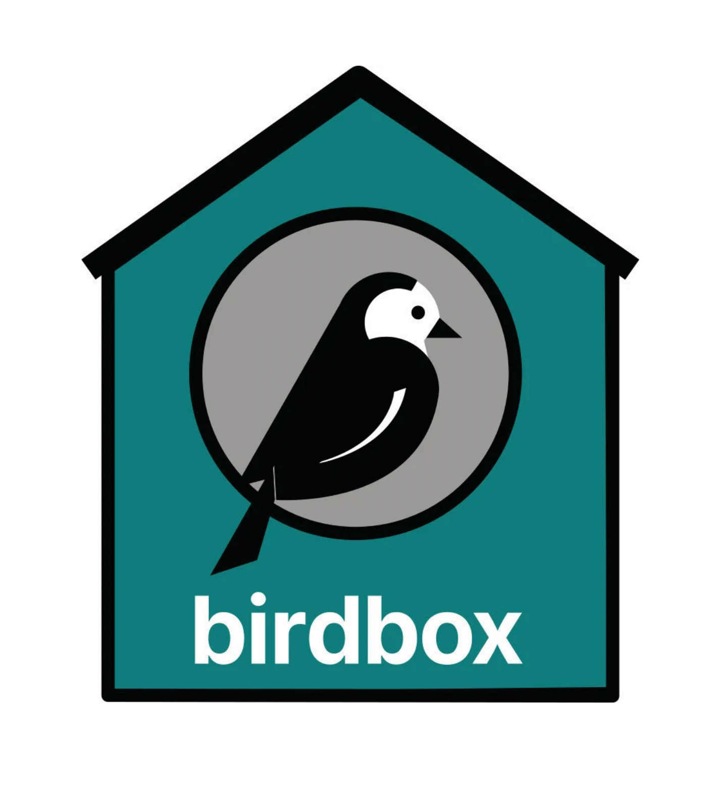

# About this codebase

This project is based on the Birdbox kit, from Mozilla MEAO (Marketing Engineering And Operations).

The documentation for the Birdbox project [lives separately](https://github.com/mozmeao/birdbox-documentation) because it is specific to the _kit_, not the projects generated with the kit.

For those with Mozilla access, a Birdbox explainer is [here](https://mozilla-hub.atlassian.net/wiki/spaces/EN/pages/444268553/Birdbox).

----

LICENSE: [Mozilla Public License Version 2.0](LICENSE)
